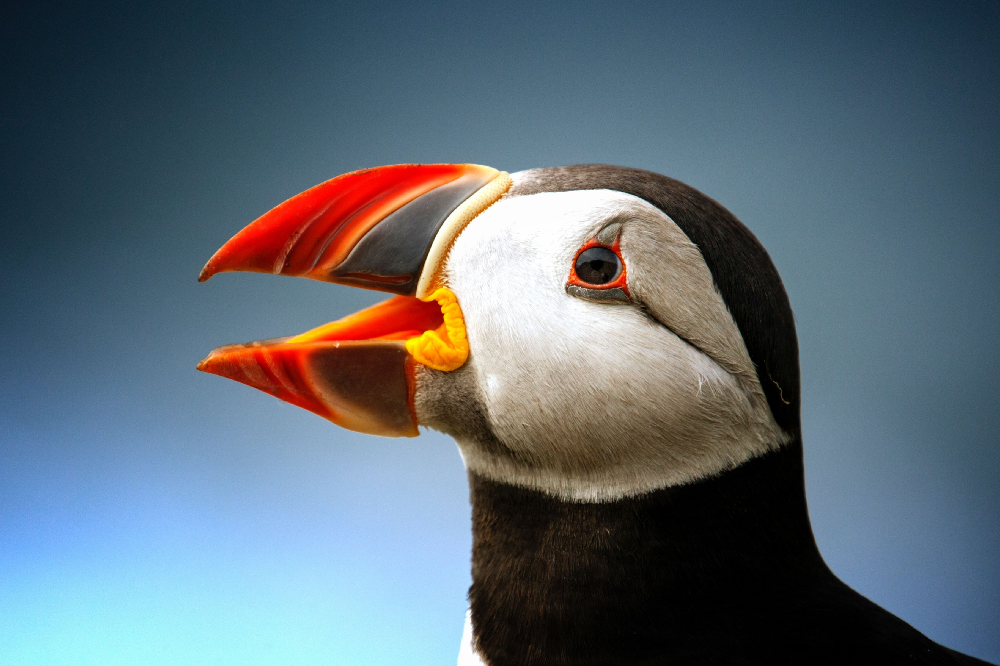

```{r setup, include = FALSE}
knitr::opts_chunk$set(
  collapse = TRUE,
  comment = "#>"
)
has_pavo <- requireNamespace("pavo", quietly = TRUE)
```

```{r}
library(lightr)
```

This vignette has two goals:

- demonstrate that `lightr` parsers produce the same output as the official
software
- show an example of analysis you can run once you've imported your data with
`lightr`

For this, we use spectral data of the beak of the [atlantic puffin, *Fratercula
arctica*](https://en.wikipedia.org/wiki/Atlantic_puffin). This data was 
collected by Dr Claire Doutrelant, using an OceanOptics spectrometer.

```{r, fig.cap="Atlantic puffin close up, by user john-289283 from pexels.com", out.width='100%'}

```

# Comparison of outputs

By default, OceanInsight spectrometers produce `.ProcSpec` files, which R 
cannot readily import. To help with this, OceanInsight official software,
SpectraSuite has a conversion feature, which turns `.ProcSpec` files into tab
separated values files (`.txt`).

So, let's start by comparing the `.ProcSpec` spectra imported by `lightr` and
the `.txt` files produced by OceanOptics.

```{r}
raw_files <- lr_get_spec(file.path("data", "puffin"), ext = "ProcSpec")
txt_files <- lr_get_spec(file.path("data", "puffin"), ext = "txt")
```

We can visually inspect these two file using the dedicated S3 function 
`pavo::plot.rspec()`:

```{r, fig.show='hold', eval=has_pavo}
library(pavo)
plot(raw_files, main = "Raw ProSpec files")
plot(txt_files, main = "Exported txt files")
```

Spectra imported by `lightr` and converted by SpectraSuite look pretty similar 
upon visual inspection and we can confirm this with

```{r}
all.equal(raw_files, txt_files, tol = 1e-4)
```

# Example of analysis

One possibly biologically relevant question would be to look at the
interspecific variability in beak colour. *I.e.*, do all puffin individuals have
roughly the same colour or are some individuals brighter, more colourful than
others?

For this, we will look at the difference in hue and brightness on the red part 
of the beak for two individuals, with `pavo::summary.rspec()` function (after
smoothing with `pavo::procspec()`):

```{r, eval=has_pavo}
beak <- procspec(raw_files, opt = "smooth")
summary(beak, subset = c("B2", "H5"))
```

Okay, these two individuals seem to differ quite a lot in terms of hue and
brightness. Now, one might ask if these difference can be perceived in bird
vision. We can test this with the `pavo::coldist()` function.

```{r, eval=has_pavo}
vis_beak <- vismodel(beak, visual = "avg.uv", achromatic = "ch.dc")
tcs_beak <- colspace(vis_beak)
coldist(tcs_beak, achromatic = TRUE)
```

The values of `dS` and `dL` are below the 1 JND ([just noticeable differences](https://en.wikipedia.org/wiki/Just-noticeable_difference))
threshold, which means that the colour of the two individuals, in spite of
their difference, looks the same to the birds.
